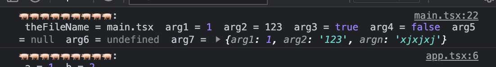
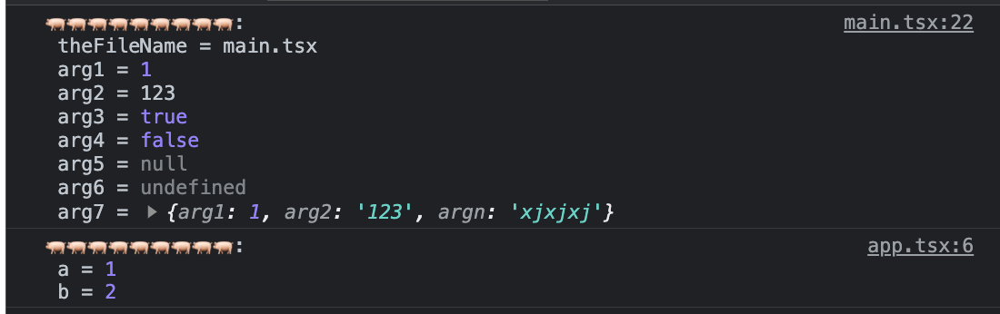
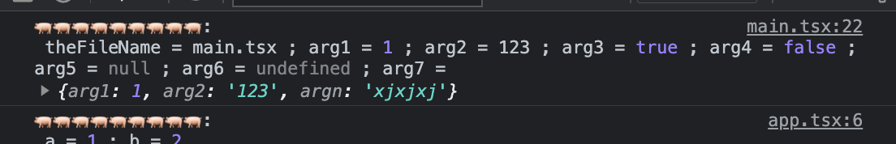
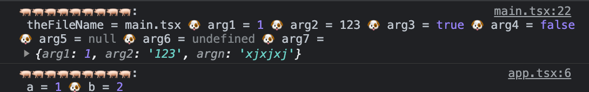
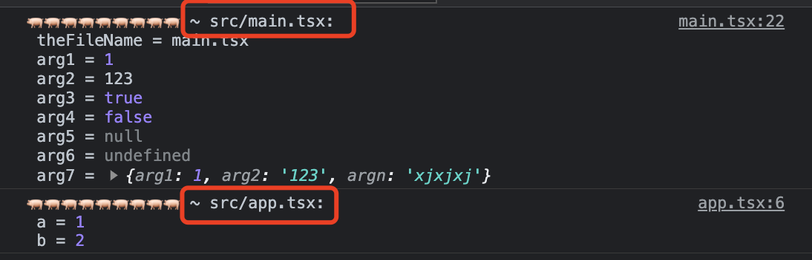
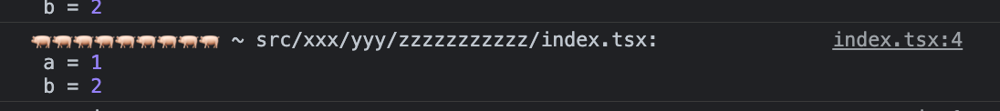
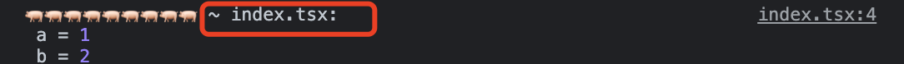

<p align="center">
<h1 align="center">vite-plugin-enhance-log</h1>
</p>

<div align="center">
  A vite Plugin to add log filename, log line, log argument name and separator

 [![NPM version][npm-image]][npm-url] ![NPM downloads][download-image]

![Test][test-badge] 

<!-- ![codecov][codecov-badge] -->


[npm-image]: https://img.shields.io/npm/v/vite-plugin-enhance-log.svg?style=flat-square
[npm-url]: http://npmjs.org/package/vite-plugin-enhance-log


[download-image]: https://img.shields.io/npm/dm/vite-plugin-enhance-log.svg?style=flat-square


[test-badge]: https://github.com/baozouai/vite-plugin-enhance-log/actions/workflows/ci.yml/badge.svg

[codecov-badge]: https://codecov.io/github/baozouai/plugin-vite-plugin-enhance-log/branch/master/graph/badge.svg


</div>

English | [中文](./README-zh_CN.md)

## 📦  Install

```sh
pnpm add vite-plugin-enhance-log -D
# or
yarn add vite-plugin-enhance-log -D
# or
npm i vite-plugin-enhance-log -D
```


## ⚙️ Options

```ts
interface Options {
  /**
   * log file name
   * If your file name is too long,
   * and you don;t want to log the directory of  the file path, 
   * such as src/pages/xxxyyy/a.tsx, 
   * then you can configure enableDir to false, and only print a.tsx
   * @default true
   */
  enableFileName?: boolean | {
    enableDir?: boolean
  }
  /**
   * tip of start argument default 🚀🚀🚀🚀🚀🚀🚀🚀🚀🚀
   * @example
   * console.log(' 🚀🚀🚀🚀🚀🚀🚀🚀🚀🚀', ...)
   */
  preTip?: string
  /** the delimiter for each parameter is an empty string by default, you can also use a newline \n, a semicolon';' a comma',' or even a pig '🐖' */
  splitBy?: boolean
  /** 
   * need endLine, default false， only if startLine unequal endLine
   * @example
   * console.log('line of 1 🚀🚀🚀🚀🚀🚀🚀🚀🚀🚀 ~ main.tsx', ..., 'line of 10 🚀🚀🚀🚀🚀🚀🚀🚀🚀🚀 ~ main.tsx')
   *  */
  endLine?: boolean
}
```
##  🔨 Usage

```ts
import { defineConfig } from 'vite'
import EnhanceLog from 'vite-plugin-enhance-log'

const config = defineConfig({
  plugins: [
    // if you use vue, ensure the vuePlugin before the log plugin
    EnhanceLog({
      splitBy: '\n',
      preTip: '🐖🐖🐖🐖🐖🐖🐖🐖🐖🐖',
      enableFileName: true, // or enableFileName: { enableDir: false}
    }),
  ],
})

export default config

```

## 👇 Example

Clone the project and start playgrounds by running:

```shell
pnpm play # corresponding to vue
# or
pnpm play:react # corresponds to react
```


For specific configuration, see [vue/vite.config.ts](./playgrounds/vue/vite.config.ts) or [react/vite.config.ts](./playgrounds/react/vite.config.ts)

For example, if you don't like small 🚀, but you like piggy 🐖, you can configure preTip as 🐖🐖🐖🐖🐖🐖🐖🐖🐖🐖:



For example, in the case of many parameters, you want log to wrap each parameter, then you can configure splitBy as `\n`:



Or the delimiter is `;`:



Of course, you can also specify it at will, such as using a dog head 🐶 to separate:



For example, if you want to know the file name where the log is located, you can configure enableFileName to be true (of course the default is true):



If the file path is too long:



and you only want to print the file name without the directory prefix, you can configure `enableFileName: { enableDir: false }`:


For another example, if there is a log that spans multiple lines, you want the number of lines at the beginning and end of the log, with the log entity in the middle, then you can set endLine to true:


> We can see that the number of lines at the beginning is 29, and the number of lines at the end is 44, which is consistent with the source code

## 📄 License

vite-plugin-enhance-log is [MIT licensed](./LICENSE).